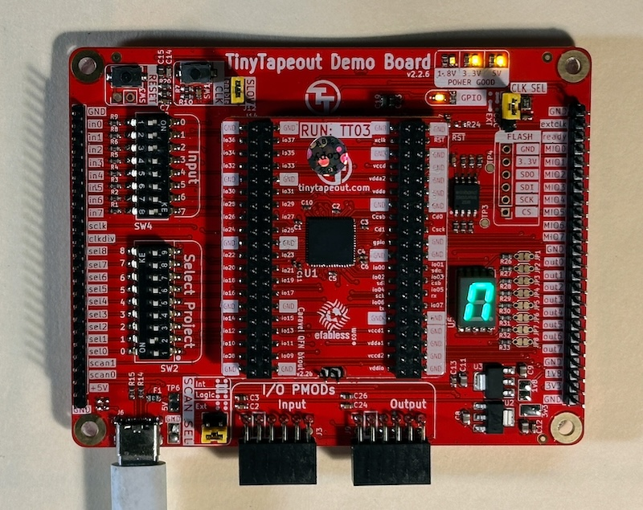

 

An ASIC design for [Tiny Tapeout](https://tinytapeout.com) 03, designed in a few evenings in spring 2023.

This implements a very simple 7-segment [cellular automaton](https://en.wikipedia.org/wiki/Cellular_automaton) from ~200 basic logic gates, using the [Wokwi web-based logic editor](https://tinytapeout.com/digital_design/wokwi/). When the Tiny Tapeout ASIC is fabricated and mounted on its standard carrier PCB (which includes 8 dip switch inputs and a 7 segment display as output), it should run the below behavior in hardware. 

**UPDATE:** A year later, in April 2024, I've received a custom fabricated ASIC with this design... and it works! Here's a quick demo of using digital inputs to load a specific initial state into it, and then putting it in run mode:

https://github.com/user-attachments/assets/e43d3b02-d3db-4b02-a358-d3ad533b861c

## Automata Behavior

I played around with a few different rulesets and this one seemed the most interesting:

At each time step, each of the seven segments is set to "alive" or "dead" based on a simple set of rules:
1) If a segment was "alive" in the previous time step and has exactly one living neighbor, it survives.
2) If a segment was "dead" (or "empty") in the previous time step and has exactly two living neighbors, if becomes alive ("gives birth")

A "neighbor" is any segment it touches, tip to tip. This means that the top and bottom segments only have two neighbors, while the side segments have three neighbors and the center segment has four neighbors.

### Example + Explanation

From the initial state shown in Step 0 below (where thin lines represent dark/dead segments, and solid blocks represent lighted/living segments), the automaton will evolve through each of the following states:
```
Step 0         Step 1         Step 2         Step 3         Step 4

 ███            ███            ---            ---            --- 
█   |          █   █          |   |          |   |          |   |          
█   |          █   █          |   |          |   |          |   |   
 ---            ███            ---            ███            --- 
|   █          |   |          █   █          |   |          █   █
|   █          |   |          █   █          |   |          █   █
 ---            ---            ---            ███            ---
```
To determine the state in Step 1:
* The two connected segments in the upper left of Step 0 survive (as they each have one living neighbor)
* The disconnected segment in the lower right of Step 0 dies (zero neighbors)
* Two segments are born in previously-empty locations: the upper right (it has the top segment and lower right segment in Step 0 as two living neighbors), and the middle segment (the upper left and lower right are its two living neighbors).

During Step 2, all the four segments in Step 1 die (two neighbors), but two new segments are born.

During Step 3, two segments die and two more are born.

During Step 4, two segments die and two more are born, and we realize it's in an infinite loop between this state and the previous state.

## Running the Automata

If using the actual hardware (the ASIC on the standard Tiny Tapeout carrier PCB):
* Ensure the Scan Chain Control is set to Internal (the default)
* Ensure the Clock Source Select jumper is set to On-Board (the default)
* Select this Tiny Tapeout project from the 256 possibilities by setting the Select Project dipswitches to project 2 (i.e. dip switch 2 on, all others off)
* Remove the Slow Clock jumper from the PCB and save it (this will be used for automatic mode below)
* Power up the system

On power-up, the segments will be initialized to an unpredictable state. You can also set them to a specific pattern as noted below.

*Side note: Earlier versions of this documentation, including the docs released to the tinytapeout site and perhaps the simulator, refer to input dip switches #1-#8. However, I see the carrier PCB as received back labels them as inputs 0 to 7. For clarity, I've updated this copy of the documentation to use their 0-7 value instead.*

To run the automaton step by step, ensure we are in manual clock stepping mode:
* In the Wokwi simulator, this involves setting the PCB clock slide switch to the "manual clock" position (not "system clock")
* On the actual hardware, ensure the Slow Clock jumper is removed

Set dip switch input #3 to on (enabling "Run" mode). 

Ensure dip switch inputs #4,5,6 are off (these are used to enable a clock divider when running in automatic mode, see below, but interfere with manual stepping).

Now, toggle dip switch 0 off and on repeatedly to step the simulation forward (on the physical hardware, you can use the convenient debounced CLK pushbutton which is connected to input 0)

### Free Running

If you have dip switch #3 on but instead have the system clock enabled (in simulation: PCB clock slide switch to the "system clock" position, in real hardware: Slow Clock jumper attached), the automaton will advance every system clock cycle.

However, this will run it too fast to see by eye. To slow it down, first configure the PCB-level clock divider to its slowest speed, which I believe should set the clock to 6250Hz/256 ~ 24Hz (on the physical hardware, do this by setting all of dip switches #0-#7 to on before you attach the Slow Clock jumper, to fix the clock divider ratio, then reset all the dip switches to off). Then use some combination of dip switches 5, 6, and 7 to further slow it down via clock dividers fabricated into logic gates in this project. Turning on dip switch 5 divides the clock by 8, dip switch 6 divides the clock by an additional 4, and dip switch 7 divides the clock by an additional 2, giving you a range of anywhere from /1 to /64 clock scaling. So, turning on dip switches 5 and 7 should give you a clock of ~1.5Hz. (**to be measured on actual hardware**)

## Setting Initial Pattern

You can set the initial state to a specific pattern by using dip switch inputs #1 and #2 to shift "alive" or "dead" states into memory:
* First, set dip switch #3 to off ("Load" mode). The period in the 7-segment display will come on to remind you you're in Load mode.
* If you cycle switch #1 to on, it loads a 0 ("dead") into segment A (the top segment), and shifts the values of all other segments to the following segments, in the A->G order shown below:
* If you cycle switch #2 to on, it loads a 1 ("alive") into segment A (the top segment), and shifts the values of all other segments as above.

*Caution: on the physical hardware, toggling dip switches on and off can be a bit glitchy due to lack of debouncing-- this may take a few tries*

Don't forget to set switch #4 back to on ("Run") when you want to run the automaton!

```
 AAA
F   B 
F   B 
 GGG
E   C
E   C
 DDD
```

*Tip on the actual hardware: the pushbutton labeled "RESET" is a debounced input connected to dip switch input #1. So for loading 'dead' segments you can use this instead of painstakingly toggling that dip switch.*

### Example

```
Initial        After cycling        After cycling        After cycling
state:         switch #2            switch #2 again      switch #1
 ---               ███                  ███                  ---           
|   |             |   |                |   █                |   █           
|   |             |   |                |   █                |   █           
 ---               ---                  ---                  ---                 
|   |             |   |                |   |                |   █                       
|   |             |   |                |   |                |   █                       
 ---               ---                  ---                  ---                 
```

## Exercises For The Reader

* How many unique initial states are there, disregarding equivalent mirrored/rotated states? (there are 2^7 = 128 possible initial states but many are equivalent)

* What fraction of these initial states survive? (i.e. don't eventually die out)

* What fraction settle into a static living pattern vs an infinite cycle between multiple different patterns?

* What is the longest sequence of unique states a pattern travels through (stop counting once it reaches a previously-visited state, beginning an infinite loop)?

* What is the longest cycle of unique states that repeats in a loop? (there's an example of a period 2 cycle in the example above)

## A Few Photos

Of logic diagrams, die renders, and the end result:





## Related Resources

Copied from the [TinyTapeout](https://tinytapeout.com) template repo:
* [TinyTapeout FAQ](https://tinytapeout.com/faq/)
* [Digital design lessons](https://tinytapeout.com/digital_design/)
* [Learn how semiconductors work](https://tinytapeout.com/siliwiz/)
* [Discord community](https://discord.gg/rPK2nSjxy8)


